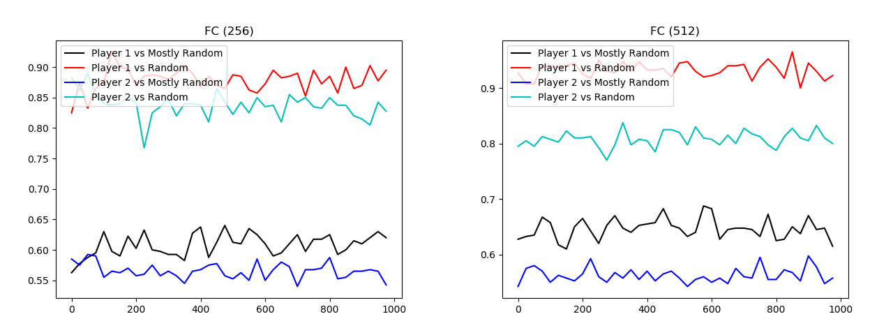
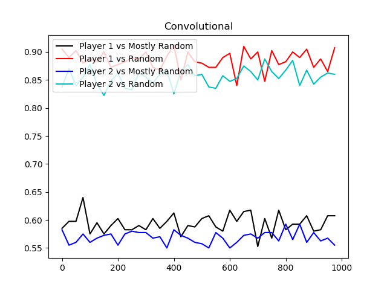

# Connect Four Deep Q-Learning

## Abstract
I've been interested in algorithms that play two player zero-sum perfect information games for a while now and have implemented several to play Tic-Tac-Toe, Connect Four, Checkers, and other games.
I haven't tried reinforcement learning though, so I figured I would give it a shot with Connect Four, which seems simple enough to be tractable but complex enough to be interesting. I used deep
Q-learning (using <a href="https://deepmind.com/research/publications/playing-atari-deep-reinforcement-learning/">this</a> as a starting point), with each player having its own Q-network that is
trained against the other player on alternating epochs. This was a lot more difficult than I expected. The best results I achieved were ~90% victory rate against a random player and ~60% victory rate
against a player who is biased towards taking moves that win the game or prevent the opponent from winning.
  

## Introduction / Background / Motivation
#### What did you try to do? What problem did you try to solve? Articulate your objectives using absolutely no jargon.
I tried to train an agent to learn to play Connect Four by (essentially) playing against itself. My goal was for the agent to be able to beat me in a game of Connect Four.

#### How is it done today, and what are the limits of current practice?
Generally Connect Four is solved with tree search algorithms like Minimax or Monte-Carlo Tree Search. In some more state of the art cases like Deepmind's AlphaZero,
board games like Connect Four (but generally more complex) are solved using a combination of Monte-Carlo Tree Search and reinforcement learning.

#### Who cares? If you are successful, what difference will it make?
Probably not many people care since Connect Four has been solved for decades, but I wanted to see if it was possible to create a strong player without using
tree search methods. If I'm successful, it could lead to more efficient algorithms to play board games as tree search is quite expensive.
  

## Approach
#### What did you do exactly? How did you solve the problem? Why did you think it would be successful? Is anything new in your approach?
I trained two deep Q-learning agents against each other. One agent took the role of player one and the other player two. I don't think there's really anything new in my
approach, except for the fact that implemented the self-play without tree search.

#### What problems did you anticipate? What problems did you encounter? Did the very first thing you tried work?
I anticipated the Q-networks not converging because of Q-learning's notorious instability and Connect Four's sparse reward. I also anticipated exploding gradients.
It turns out that the Q-networks indeed didn't converge when I got my first implementation working. The very first things I tried were the various tricks detailed in the
<a href="https://deepmind.com/research/publications/playing-atari-deep-reinforcement-learning/">Deepmind Atari deep Q-learning paper</a> like experience replay, which decorrelates samples
by storing them then training on batches of them out of order. These tricks weren't enough though. In order to get better than random performance, I implemented
<a href="https://arxiv.org/pdf/1810.09967.pdf">eligibility traces</a>. This is a technique that propagates reward to predecessor states to make the reward less sparse.
  

## Experiments and Results
#### How did you measure success? What experiments were used? What were the results, both quantitative and qualitative? Did you succeed? Did you fail? Why?
I measured success by the victory rate of the trained players against two weak baseline players, as well as my own qualitative assessment based on observing them play
against me and each other. I would say I failed. The two baseline players were a random player and a "mostly random" player, who was biased towards moves that result in
immediate victory or prevent immediate defeat. The best either of the trained players did against the baselines were ~90% victory against random and ~60% victory against
mostly random. Qualitatively I could see that they had both run into a local minimum where they pick a column and play there repeatedly, occasionally blocking the other player.
Once I got these results, which were at least better than random, I started varying the Q-network architecture. I tried two fully connected networks with 3 hidden layers that
had either 256 or 512 neurons per layer. I also tried a CNN with convolutional layers of 64, 64, and 128 channels followed by 2 hidden layers with 256 neurons per layer.
In the graphs the x-axes measure epochs and the y-axes measure win rate.
  

## Technical Details
#### What representations of input and output did the neural network expect? How was the data pre/post-processed?
The convolutional Q-network expected a 2x6x7 tensor. Each of the 2 6x7 tensors represented which tiles were occupied by
a particular player. The fully connected Q-networks expected this same tensor, except flattened to be an 84 dimensional vector.
All of the Q-networks output a 6 dimensional vector, each dimension contains the estimated Q-value of the corresponding action given
the input board state.
#### What was the loss function?
First of all the target value the loss was computed against is determined using eligibility traces. It is a weighted (based
on how far the state is from terminal) average of the future reward (in the particular episode the state was obtained in)
and the Q estimate in the next state, which is then discounted and added to the current reward. I then square this difference,
so I'm using L2 loss. I considered using Huber loss, which is quadratic for small input and linear for large input, to offset
exploding gradients, but I didn't actually run into exploding gradients.
#### Did the model overfit? How well did the approach generalize?
I'm not sure how well this question applies to reinforcement learning, especially with self play. On one hand it underfit because
the loss didn't consistently go down. But on the other hand the target the loss was computed against was constantly changing (non-stationarity).
#### What hyperparameters did the model have? How were they chosen? How did they affect performance? What optimizer was used?
The main hyperparameters were the discount factor, the explore rate (epsilon in epsilon-greedy), and what I called future weight (called lambda in the eligibility traces paper, determines how much to weight future reward in episode vs estimated Q-value). I chose the explore rate to be 0.99 somewhat arbitrarily, as I've read that it makes little difference as long as it's high enough for short episodes (each episode in connect four is guaranteed to be at most 42 moves). I set epsilon to a high initial value (0.6) then decay to a minimum of 0.02. I chose these values and the decay rate by making sure the model had at least a couple hundred epochs with high exploration and a couple hundred with little exploration. I set the future weight according to the best performing value (0.6) in the eligibility traces paper. I didn't worry too much about the value because in the paper their experiments varying this value didn't affect the performance much.
#### What Deep Learning framework did you use?
I used Pytorch.
#### What existing code or models did you start with and what did those starting points provide?
I adapted code from <a href="https://github.com/mevdschee/python-connect4">here</a> to make the connect four gui. Other than that I coded and trained everything myself. It was nice to not have to make a gui from scratch, as that can take up a lot of time.
